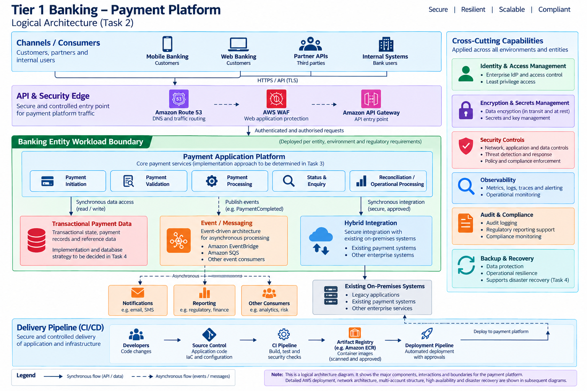

# Executive Architecture Paper

**Selected Cloud:** Amazon Web Services (AWS)

## Executive Summary

This paper proposes a target architecture for modernization of a multi-country Tier 1 payments platform on Amazon Web Services (AWS).

The architecture is designed around the required 99.99% availability target for critical payment journeys, a 30-minute Recovery Time Objective (RTO), near-zero Recovery Point Objective (RPO) for committed payment transactions, regulatory data residency, banking-entity isolation, hybrid integration with existing on-premises systems, security, auditability, cost transparency, and progressive migration.

The design treats transaction integrity, security, regulatory boundaries, and recoverability as primary architecture concerns. AWS managed services will be used where their operational and resilience benefits justify the dependency, while application portability will be addressed through application architecture, interfaces, data and event contracts, portable packaging, and deployment automation rather than relying on a single compute platform.

---

## 1. Architecture Framing

### 1.1 Architecture Principles

The following principles guide architecture decisions throughout the modernization.

| ID | Principle | Application to the Payments Platform |
|---|---|---|
| P1 | Security and compliance by design | Security, regulatory controls, auditability, and data protection are incorporated into the architecture and delivery lifecycle rather than added after deployment. |
| P2 | Design for failure | Critical payment journeys must tolerate expected infrastructure and application failures without depending on manual recovery for routine failure scenarios. |
| P3 | Preserve transaction integrity | Availability must not be achieved at the expense of payment correctness. Committed transactions must remain durable, traceable, and protected against unintended duplicate processing. |
| P4 | Isolate according to risk and regulatory boundaries | Banking entities, environments, workloads, administrative privileges, and regulated data are separated according to their security and regulatory requirements. |
| P5 | Automate repeatable controls and change | Infrastructure, security controls, configuration, testing, and deployment should be automated and version controlled wherever practical. |
| P6 | Prefer managed services where justified | AWS managed services are preferred where they satisfy security, reliability, operational, portability, and cost requirements. Lower-level control is retained where workload requirements justify it. |
| P7 | Achieve portability through application design | Portability is achieved through portable packaging, documented APIs and event contracts, externalized configuration, deployment automation, and deliberate management of service dependencies rather than assuming that a particular orchestration platform guarantees portability. |
| P8 | Observability by design | Critical journeys must provide sufficient metrics, logs, traces, and events to support SLO measurement, operations, audit, security investigation, and incident response. |
| P9 | Prove recovery and migrate progressively | Recovery capability must be regularly validated. Migration is performed through measurable and reversible stages rather than a single high-risk cutover. |

These principles are informed by the AWS Well-Architected Framework, particularly its Security, Reliability, Operational Excellence, Performance Efficiency, and Cost Optimization pillars. They are adapted to the specific requirements of a regulated Tier 1 payments workload rather than used as generic cloud principles.

### 1.2 Quality Attributes and Hard Constraints

| Attribute / Constraint | Architecture Objective |
|---|---|
| Availability | Target 99.99% end-to-end availability for defined critical payment journeys. Critical components must avoid single points of failure within the intended availability design. |
| Reliability | Preserve correct, durable, and traceable payment state. Retry and recovery mechanisms must not create unintended duplicate financial transactions. |
| Recoverability | Critical payment capabilities must support a 30-minute RTO. Near-zero RPO is required for committed payment transactions, with limitations explicitly identified where this cannot credibly be guaranteed for a given failure scenario. |
| Security | Apply least privilege, strong identity controls, encryption, network protection, secure administration, and preventive, detective, and responsive controls. |
| Auditability | Material administrative, security, configuration, and deployment activities must produce protected and centrally accessible audit evidence. |
| Data Residency | Regulated data must remain within locations approved for the relevant banking entity. Primary, replica, backup, and DR data placement must respect the same requirement. |
| Entity Isolation | Banking entities must be isolated according to agreed security, administrative, data, and regulatory boundaries. |
| Hybrid Integration | The target platform must coexist and integrate with existing on-premises systems during migration. |
| Performance | The architecture must support predictable performance; final latency, throughput, and capacity targets require measured workload characteristics and performance testing. |
| Scalability | The platform must accommodate transaction growth and peak demand without fundamental architectural redesign. |
| Portability | Application design must minimize unnecessary coupling to the compute platform while explicitly documenting justified dependencies on AWS-native services. |
| Operability | Platform and product teams must be able to measure health, SLOs, dependencies, and failure conditions using actionable telemetry. |
| Maintainability | Application and infrastructure changes should be version controlled, testable, repeatable, and reversible where practical. |
| Cost Transparency | Cloud consumption must be attributable to appropriate entities, environments, and workloads. |
| Migration | Modernization must support progressive migration, coexistence, validation, and rollback rather than requiring a single big-bang replacement. |

The 99.99% availability target, 30-minute RTO, near-zero RPO for committed transactions, hybrid integration, entity isolation, data residency, security, auditability, cost transparency, progressive migration, and ownership model are treated as hard architecture constraints.

### 1.3 Decision Ownership

Architecture decisions span multiple organizational responsibilities. The Solution Architect coordinates these requirements and translates them into technical decisions but does not independently own regulatory, business, or enterprise policy decisions.

| Decision Area | Primary Owner | Architecture Responsibility |
|---|---|---|
| Critical business journeys and business criticality | Business / Product | Translate criticality into availability, recovery, performance, and dependency requirements. |
| Regulatory obligations and permitted data locations | Risk / Compliance / Legal | Translate approved boundaries into enforceable technical controls and data placement. |
| Landing zone and organizational guardrails | Central Platform Team | Design workloads within the governed AWS foundation and identify required platform capabilities. |
| Enterprise and hybrid networking | Platform / Network Team | Jointly define resilient connectivity, routing, inspection, and failure behaviour. |
| Security standards and control objectives | Security | Map security requirements to preventive, detective, and responsive architecture controls. |
| Application architecture | Product / Application Team | Define application patterns within enterprise architecture standards and guardrails. |
| Application SLOs | Product Team | Provide architecture and telemetry capable of measuring and meeting defined SLOs. |
| Transaction and data architecture | Product / Data Owners | Define transaction boundaries, consistency, lifecycle, replication, reconciliation, and recovery patterns. |
| Disaster recovery requirements | Business / Risk / Technology | Implement, test, and demonstrate recovery against agreed RTO and RPO objectives. |
| Cloud cost accountability | Product / Platform / FinOps | Provide allocation, visibility, and optimization mechanisms for cloud consumption. |

### 1.4 Assumptions and Exclusions

The scenario intentionally leaves several implementation details unspecified, including the participating countries, approved AWS Regions, transaction volumes, existing database technology, application runtime architecture, and enterprise identity provider.

The architecture therefore distinguishes explicit assessment requirements from assumptions. Unknown workload characteristics will not be replaced with invented capacity or performance figures.

Detailed assumptions, exclusions, and validation requirements are maintained in [Assumptions and Exclusions](06-assumptions-and-exclusions.md).

### 1.5 Architecture Governance

The AWS environment will use a centrally governed multi-account model. AWS Organizations will provide the organizational hierarchy, with Organizational Units (OUs) and AWS accounts used to establish administrative, workload, environment, and entity boundaries.

AWS Control Tower will provide the governed landing-zone foundation. Organizational controls will be applied according to central platform, security, and regulatory requirements. Preventive controls will be used where prohibited actions should be technically restricted, while detective controls will identify configuration non-compliance. Proactive controls may be applied to supported infrastructure definitions before provisioning.

Service Control Policies (SCPs) will be used where organization-level permission boundaries are required. SCPs are treated as permission guardrails rather than permission grants; workload access remains governed through the appropriate AWS Identity and Access Management (IAM) policies and roles.

Significant infrastructure configuration should be managed through approved Infrastructure as Code (IaC) and deployment pipelines wherever practical. This provides version history, peer review, repeatability, automated validation, and traceability between approved change and deployed infrastructure.

Audit and configuration evidence will be centrally retained. AWS CloudTrail will provide evidence of AWS API and account activity, while AWS Config and associated controls can provide resource configuration history and compliance evaluation where applicable.

Material architecture decisions will be documented using Architecture Decision Records (ADRs), including context, decision drivers, alternatives, consequences, risks, and review triggers. Deviations from architecture standards require an explicit exception with an accountable owner, documented rationale, compensating controls where necessary, and a review or expiry condition.

Governance will favor automated controls for deterministic requirements while reserving human architecture review for decisions requiring business, regulatory, security, or technical judgment. This approach is intended to provide strong governance without making the central platform team a deployment bottleneck for product teams.

## 2. Target Architecture

### 2.1 Architecture Overview

The target architecture uses a governed AWS multi-account model with explicit separation between central security, infrastructure, shared services, and banking-entity workloads. Critical payment workloads are designed for Multi-AZ operation within an approved AWS Region, while hybrid connectivity supports coexistence with existing on-premises systems throughout the migration.

The architecture separates four concerns:

- **Governance:** organizational structure, account boundaries, guardrails, and centralized controls.
- **Connectivity and security:** hybrid connectivity, network segmentation, inspection, and controlled ingress.
- **Application and data:** payment services, transactional data, APIs, and synchronous/asynchronous integration.
- **Operations and delivery:** observability, audit, security monitoring, Infrastructure as Code (IaC), and controlled CI/CD.

The logical architecture is shown below.

The logical view intentionally leaves the payment compute platform and transactional database implementation open. The compute platform is evaluated in Section 3, while the transactional data and disaster recovery strategy is evaluated in Section 4.

### 2.2 Multi-Account and Entity Isolation

AWS Organizations provides the organizational foundation for the target environment. AWS accounts are used as security, access, billing, and blast-radius boundaries rather than placing all workloads into a single shared account.

The proposed organizational model separates:

- central security tooling and log archival;
- central network and shared services;
- production and non-production workloads; and
- banking entities where separate security, regulatory, administrative, or data boundaries are required.

A conceptual structure is:

    AWS Organization
    ├── Security OU
    │   ├── Security Tooling
    │   └── Log Archive
    │
    ├── Infrastructure OU
    │   ├── Network
    │   └── Shared Services
    │
    └── Workloads OU
        ├── Entity A
        │   ├── Production
        │   └── Non-Production
        │
        └── Entity B
            ├── Production
            └── Non-Production

The entity names above are illustrative rather than assumptions about the bank's actual legal structure.

Entity isolation is not limited to network segmentation. Depending on approved regulatory and security requirements, isolation may include AWS accounts, VPCs, IAM roles, encryption keys, data stores, deployment permissions, logging boundaries, and cost allocation.

Direct communication between entity workloads is not assumed. Where cross-entity communication is required, it must use an explicitly approved integration path with appropriate authorization, logging, and security controls.

### 2.3 Availability and Failure Domains

Critical payment services are designed to operate across multiple Availability Zones within the selected primary AWS Region.

Application capacity will be distributed so that the loss of a single Availability Zone does not inherently result in loss of the critical payment journey. Selected stateful AWS services must similarly provide an appropriate Multi-AZ resilience model.

Multi-AZ architecture provides high availability against localized infrastructure failures but is not treated as a complete regional disaster recovery strategy. Regional disaster recovery, replication, failover, and recovery limitations are addressed separately in Section 4.

The architecture does not assume that 99.99% availability requires active-active operation across multiple AWS Regions. The availability target applies to defined critical payment journeys and must be validated through end-to-end dependency analysis, failure testing, monitoring, and SLO measurement.

### 2.4 Network and Hybrid Connectivity

Each banking-entity workload is hosted within an appropriately isolated Amazon VPC. Workload resources are distributed across Availability Zones using separate subnets and routing according to their function and security requirements.

Inter-VPC and hybrid connectivity uses a centrally governed transit model based on AWS Transit Gateway rather than independent point-to-point connectivity between every workload network.

The central Network account owns the shared connectivity layer. Transit Gateway routing is used to control connectivity between workload VPCs, shared services, security inspection capabilities, and approved on-premises networks.

Hybrid connectivity is designed around resilient enterprise connectivity. AWS Direct Connect is used as the primary private connectivity mechanism where available and justified, with redundant connectivity and/or AWS Site-to-Site VPN providing additional resilience according to the final network design.

Traffic crossing defined network trust boundaries is routed through appropriate inspection controls. AWS Network Firewall may provide centralized network inspection where required, while Security Groups provide workload-level network access controls.

Entity-to-entity routing is not enabled by default. Connectivity is explicitly introduced only for approved dependencies.

Detailed Direct Connect topology, bandwidth, BGP configuration, carrier diversity, and physical connectivity cannot be finalized without the bank's existing network architecture and connectivity requirements.

### 2.5 Application and Integration Architecture

External and internal consumers access the payment platform through controlled API interfaces.

Amazon Route 53 provides DNS and traffic-routing capabilities, while AWS WAF provides application-layer protection for supported HTTP/S entry points. Amazon API Gateway provides a managed API entry layer for appropriate payment APIs and backend integrations.

The underlying application runtime remains deliberately undecided in this section. Amazon ECS, Amazon EKS, AWS Lambda, and Amazon EC2 are evaluated against representative payment-platform components in Section 3.

Application integration uses both synchronous and asynchronous communication patterns.

Synchronous communication is retained where an immediate response is required as part of the critical transaction path. Asynchronous integration is preferred for activities that do not need to block payment completion, reducing unnecessary runtime coupling between payment processing and secondary consumers.

Amazon EventBridge and Amazon SQS may be used for event routing and durable asynchronous processing where their respective behavior fits the integration requirement.

For example, a committed payment may produce a payment-completed event for downstream notification, reporting, analytics, or other consumers without requiring all of those consumers to be available before the critical transaction can complete.

Events and queues do not replace transaction integrity mechanisms. Reliable coordination between committed transactional state and event publication is addressed as part of the data architecture in Section 4.

Hybrid integration provides controlled connectivity to existing on-premises systems during coexistence and migration. The design does not assume the implementation technology of those existing systems.

### 2.6 Identity, Encryption and Secrets

Workforce access to AWS is federated with the bank's enterprise identity provider through a centrally managed identity model, such as AWS IAM Identity Center, subject to validation against the existing identity architecture.

AWS IAM roles and policies provide workload and administrative authorization according to least-privilege principles. Long-lived application credentials are avoided where AWS workload identities and temporary credentials can be used.

Deployment pipelines use controlled deployment roles scoped to the relevant workload and environment. A deployment identity for one banking entity must not implicitly provide deployment privileges to another entity.

Sensitive application secrets are managed separately from application source code using an approved secrets-management capability such as AWS Secrets Manager.

AWS Key Management Service (AWS KMS) provides managed encryption-key capabilities for supported workloads and data services. Key ownership and separation will follow the required entity, regulatory, and data-classification boundaries.

Data is encrypted in transit and at rest using controls appropriate to the selected services and regulatory requirements.

### 2.7 Observability, Audit and Security Monitoring

Observability is designed around the critical payment journey rather than infrastructure health alone.

Application and platform telemetry includes:

- metrics;
- structured logs;
- distributed traces where appropriate;
- alarms and operational events; and
- business/service indicators required to measure defined SLOs.

Amazon CloudWatch provides native AWS monitoring, logging, and alerting capabilities. Application telemetry should support correlation across distributed components without unnecessarily recording sensitive payment or authentication data.

AWS CloudTrail provides audit evidence of relevant AWS API and account activity. AWS Config can provide resource configuration history and compliance evaluation for supported resources.

Security findings are centrally visible to the security function. Services such as Amazon GuardDuty, Amazon Inspector, AWS Config, and AWS Security Hub may contribute to organization-wide detection and security posture management according to the final security control design.

Long-term audit and security logs are separated from workload administration through centralized security and log-archive capabilities. Log centralization must itself respect applicable data residency and sensitive-data requirements.

Product teams remain responsible for application telemetry and SLOs, while central platform and security teams provide organization-wide logging, security monitoring, governance, and shared operational capabilities.

### 2.8 Deployment and Delivery

Application and infrastructure changes are delivered through controlled CI/CD pipelines rather than routine manual production changes.

The delivery flow follows the pattern:

    Source Control
         ↓
    Build and Test
         ↓
    Security / Dependency Checks
         ↓
    Approved Artifact
         ↓
    Controlled Deployment
         ↓
    Workload Environment

For containerized components, Amazon Elastic Container Registry (ECR) provides a managed container-image registry. Container images are scanned according to the required vulnerability-management policy before promotion to production.

Infrastructure changes are managed through approved Infrastructure as Code where practical, enabling version control, peer review, repeatability, validation, and traceability.

The architecture does not prescribe a specific enterprise source-control or CI/CD product because the bank's existing development toolchain is not provided. Existing enterprise tooling may be retained where it satisfies the required identity, security, approval, audit, and deployment controls.

Production releases should support progressive deployment and controlled rollback where technically feasible. Application rollback must be distinguished from database and transactional-state recovery, because a software version can often be reverted more easily than committed financial data.

The resulting delivery model combines centralized platform guardrails with decentralized application ownership: the central platform team defines the governed AWS foundation, while product teams build, deploy, observe, and operate their applications within those boundaries.

## 3. Application Platform Decision

### 3.1 Decision Context

The payment platform contains a mixture of long-running APIs and services, asynchronous processing, integration components, and potentially legacy workloads that may not share the same compute requirements.

The application platform therefore does not force all workloads onto a single compute model. Amazon ECS, Amazon EKS, AWS Lambda, and Amazon EC2 are evaluated according to workload characteristics, operational complexity, resilience, security, deployment control, cost transparency, and portability.

The default platform should minimize unnecessary operational complexity while preserving sufficient flexibility for exceptional workload requirements.

### 3.2 Compute Platform Comparison

| Option | Strengths | Trade-offs | Position in Target Architecture |
|---|---|---|---|
| Amazon ECS with AWS Fargate | AWS-native container orchestration; no Kubernetes control plane or worker-node management required with Fargate; supports service scaling and Multi-AZ placement; integrates with AWS identity, networking, load balancing, logging, and deployment capabilities. | AWS-specific orchestration model; Fargate provides less host-level control than EC2-backed containers; portability still depends on application design and external service dependencies. | **Default for long-running containerized payment services.** |
| Amazon EKS | Managed Kubernetes control plane; Kubernetes APIs and ecosystem; appropriate where Kubernetes standards, tooling, operators, or existing Kubernetes workloads are required. | Greater platform and operational complexity; requires Kubernetes-specific skills, security controls, lifecycle management, and governance. Kubernetes does not by itself remove dependencies on AWS-native data, identity, messaging, networking, or security services. | **Not the default.** Reconsider where a demonstrated Kubernetes requirement exists. |
| AWS Lambda | Event-driven execution model with infrastructure scaling managed by AWS; suitable for short-lived event handlers, automation, and selected asynchronous processing. | Different execution and operational model from continuously running services; runtime and execution constraints must be considered; unsuitable for workloads requiring persistent processes or host-level control. | **Selective use for suitable event-driven workloads.** |
| Amazon EC2 | Maximum operating-system and host-level control; broad compatibility with existing software and specialized runtime requirements. | Highest infrastructure-management responsibility among the evaluated options, including instance lifecycle, operating-system maintenance, capacity, and associated controls. | **Exception path for legacy or specialized workloads requiring VM/host control.** |

### 3.3 Default Runtime: Amazon ECS with AWS Fargate

Amazon ECS with AWS Fargate is selected as the default runtime for long-running containerized payment services.

Representative workloads include payment initiation APIs, payment validation services, payment processing services, and status or enquiry APIs where those components can be packaged as containers and do not require host-level control.

The decision is based primarily on operational simplicity rather than an assumption that ECS provides inherently better application functionality than Kubernetes.

Fargate removes the requirement for product teams to provision and maintain the underlying container host fleet. ECS provides the orchestration layer while the application team retains responsibility for container images, application configuration, IAM permissions, network access, telemetry, scaling configuration, deployment behaviour, and application security.

Critical services will run with multiple tasks distributed across Availability Zones so that the failure of a single task or Availability Zone does not inherently remove the service. Load balancing, health checks, scaling policies, deployment configuration, and dependency resilience must be designed consistently with the end-to-end availability objective.

The 99.99% availability target is not attributed to ECS or Fargate alone. It remains an end-to-end service objective dependent on application design, data services, network paths, integrations, operational controls, and downstream dependencies.

### 3.4 Selective Use of AWS Lambda

AWS Lambda may be used where an event-driven execution model provides a clear fit.

Candidate use cases include short-lived event processing, selected asynchronous integration, operational automation, and processing that does not require a continuously running service.

Lambda is not selected as the universal payment runtime. Critical transaction processing should not be decomposed into functions solely to adopt a serverless model. Function boundaries must follow application and transaction requirements rather than the capabilities of the compute service.

Where Lambda participates in payment-related processing, retry behaviour, duplicate delivery, idempotency, concurrency, failure handling, observability, and downstream service limits must be explicitly considered.

### 3.5 EC2 Exception Path

Amazon EC2 remains available for workloads that cannot initially meet the container platform requirements or that require operating-system, runtime, networking, or host-level capabilities unavailable through the preferred managed compute model.

This is particularly relevant during progressive migration, where an existing application component may need to move before it can be materially refactored.

EC2 usage is therefore treated as a justified exception rather than the default modernization target. Exceptions should document the technical requirement, operational implications, security controls, modernization dependency, and review trigger.

This approach prevents the target architecture from requiring unnecessary application rewrites as a prerequisite for migration while avoiding indefinite expansion of unmanaged legacy patterns.

### 3.6 Why Amazon EKS Is Not the Default

Amazon EKS was considered because Kubernetes provides a standardized orchestration API, a broad ecosystem, and potential alignment with organizations that have established Kubernetes platforms and skills.

The assessment, however, does not identify an existing Kubernetes standard, Kubernetes-specific workload requirement, or organizational dependency on the Kubernetes ecosystem.

Selecting EKS solely to claim application portability would therefore introduce additional platform concepts and operational responsibilities without a demonstrated requirement.

Kubernetes can improve portability of orchestration definitions and platform practices, but it does not automatically make the application cloud-independent. Applications may remain coupled through identity, databases, messaging, networking, security services, observability, and other external dependencies.

EKS should be reconsidered if:

- Kubernetes becomes an enterprise platform standard;
- significant existing workloads already depend on Kubernetes APIs or operators;
- required tooling depends on the Kubernetes ecosystem;
- platform-team capability makes Kubernetes operational overhead acceptable; or
- future workload requirements demonstrate benefits that outweigh the additional complexity.

The decision is therefore not that EKS is unsuitable for Tier 1 banking workloads, but that its additional capabilities are not currently justified by the stated requirements.

### 3.7 Portability Strategy

Application portability is addressed independently from the selection of ECS as the default runtime.

Containerized services should use OCI-compatible container images and avoid relying on persistent local container state. Runtime configuration should be externalized from the application image, and secrets should be injected through controlled mechanisms rather than embedded in source code or images.

Service interfaces should use documented contracts such as versioned APIs and event schemas. Integration behaviour, including retries, timeouts, idempotency, and failure handling, should be explicit rather than dependent on undocumented platform behaviour.

Infrastructure and deployment configuration should be maintained as version-controlled automation. AWS-specific dependencies are permitted where they provide justified security, reliability, operational, or cost benefits, but those dependencies should be explicit rather than hidden throughout application logic.

Portability therefore means maintaining practical migration boundaries and avoiding unnecessary compute-platform coupling. It does not imply that migration to another cloud or runtime would be cost-free.

### 3.8 Decision Summary

The target application platform uses a workload-appropriate compute strategy rather than a single mandatory runtime:

- **Amazon ECS with AWS Fargate** is the default for long-running containerized payment APIs and services.
- **AWS Lambda** is used selectively for suitable short-lived and event-driven workloads.
- **Amazon EC2** supports justified legacy or specialized requirements where host-level control is necessary.
- **Amazon EKS** is retained as an alternative where a demonstrated Kubernetes requirement justifies its additional operational complexity.

This decision will be reviewed if application discovery identifies incompatible runtime requirements, enterprise platform standards change, Kubernetes-specific dependencies emerge, or measured cost, performance, security, or operational characteristics materially alter the trade-off.

## 4. Data and Disaster Recovery

### 4.1 Data Architecture Decision

Amazon Aurora PostgreSQL is selected as the default authoritative transactional data store for committed payment state, subject to validation during application and data discovery.

The selection is based on the expected need for relational transaction semantics, ACID transactions, consistency, durable payment state, and controlled relationships between payment records. The assessment does not provide the existing database technology, schema, transaction volume, or access patterns; therefore, the selection must be validated against measured workload and application requirements before implementation.

Amazon DynamoDB remains appropriate for workloads whose access patterns and scale characteristics favor a key-value or document model, but it is not selected as the default system of record solely for scalability.

The architecture separates authoritative transactional state from derived data, events, reporting data, caches, and other secondary representations. A downstream event or reporting record must not become the authoritative source of payment status.

### 4.2 Transaction Integrity

Payment correctness takes precedence over maximizing availability during ambiguous failure conditions.

Each payment is assigned a durable identifier that can be used to identify retries and prevent unintended duplicate financial processing. Application operations that may be retried must implement appropriate idempotency controls.

Where a committed database transaction must result in downstream event publication, the architecture uses a transactional outbox pattern.

The payment-state change and corresponding outbox record are written within the same local database transaction:

    BEGIN TRANSACTION

      Update authoritative payment state

      Write corresponding outbox record

    COMMIT

An independent publisher subsequently reads committed outbox records and publishes the required events to the messaging layer.

This avoids relying on a distributed transaction between the relational database and messaging platform and reduces the risk of a committed payment being permanently separated from its corresponding event.

The pattern does not imply exactly-once end-to-end delivery. An event may be delivered more than once during retry or failure scenarios. Consumers must therefore implement idempotent processing using stable payment and/or event identifiers.

Transaction state transitions must also be explicitly defined so that recovery processes can distinguish completed, rejected, pending, retryable, and ambiguous transactions.

### 4.3 High Availability Within the Primary Region

The authoritative Aurora database is deployed using a Multi-AZ architecture within the approved primary AWS Region.

Critical application services are similarly distributed across multiple Availability Zones. Application instances are treated as replaceable compute capacity and do not retain authoritative payment state locally.

This design protects the critical journey against the infrastructure failure scenarios covered by the selected Multi-AZ services without requiring regional disaster recovery for routine instance or Availability Zone failures.

Application health checks, database connectivity, dependency behaviour, retry policies, timeouts, and failover behaviour must be tested under failure conditions. Multi-AZ deployment alone does not demonstrate achievement of the 99.99% end-to-end availability target.

### 4.4 Regional Disaster Recovery Strategy

A secondary approved AWS Region provides disaster recovery capability for a regional failure or other event requiring the primary Region to be abandoned.

Aurora Global Database provides cross-Region replication from the authoritative primary database to a secondary Aurora cluster in the DR Region.

The target model uses a warm-standby approach rather than multi-Region active-active payment processing. Under normal conditions, one Region remains authoritative for payment writes.

The DR Region maintains the infrastructure, connectivity, security configuration, data replication, and minimum application capability required to support recovery within the defined 30-minute RTO. Capacity that does not need to operate at full production scale during normal conditions may be increased as part of the recovery procedure.

The design avoids simultaneous independent payment writes in multiple Regions unless a future architecture explicitly addresses transaction ownership, consistency, conflict handling, and reconciliation.

### 4.5 Regional Failover

Regional failover is a controlled operational procedure rather than an assumption that traffic should automatically move to the secondary Region whenever the primary Region becomes unavailable.

A representative recovery sequence is:

1. Detect and declare the regional incident.
2. Contain or stop payment writes to the failed primary environment where possible.
3. Determine the latest replicated transaction position and assess replication health.
4. Promote the secondary Aurora cluster to become the authoritative database.
5. Start or scale the DR application services to the required recovery capacity.
6. Validate identity, network, security, integration, messaging, and on-premises dependencies.
7. Execute technical and payment-journey validation.
8. Redirect controlled production traffic to the recovered Region.
9. Reconcile transactions affected around the failure boundary.
10. Continue heightened monitoring until transaction state and downstream processing are confirmed stable.

Detailed automation and operational runbooks must be developed and tested before production use.

DNS and traffic-management capabilities may support traffic redirection, but routing alone must not determine whether the secondary payment environment is safe to become authoritative.

### 4.6 RTO and RPO

The architecture targets recovery of critical payment capabilities within the required 30-minute RTO.

Achievement of this target depends on more than database promotion. Recovery testing must include application capacity, network connectivity, identity, secrets and keys, messaging, external dependencies, on-premises integration, traffic redirection, validation, and operational decision time.

The architecture also targets near-zero RPO for committed payment transactions.

Within the primary Region, the selected Multi-AZ database architecture is designed to protect committed data against the infrastructure failures covered by that architecture.

For catastrophic loss of the primary Region, cross-Region Aurora Global Database replication is asynchronous. A residual possibility therefore exists that the most recently committed transactions have not reached the secondary Region at the instant of failure.

The architecture consequently does not claim absolute zero data loss for every regional disaster scenario.

Cross-Region replication lag must be continuously monitored and included in operational recovery decisions. Transactions around the failure boundary must be reconciled against available internal and external evidence.

If the business requirement is subsequently clarified as an absolute RPO of zero even under instantaneous complete loss of the primary Region, the cross-Region data architecture must be revisited rather than representing asynchronous replication as satisfying that stronger requirement.

### 4.7 Transaction Reconciliation

Recovery of infrastructure does not by itself prove recovery of the payment service.

Following a significant failure or regional failover, reconciliation identifies transactions whose final state may be ambiguous.

Reconciliation may compare:

- authoritative payment records;
- transaction and idempotency identifiers;
- transactional outbox records;
- published and consumed events;
- integration acknowledgements;
- available records from existing bank systems; and
- available records from external payment participants or partners.

The exact reconciliation sources depend on the payment rails and existing systems, which are not specified in the assessment.

Transactions identified as inconsistent or ambiguous are handled through controlled operational procedures rather than automatically replayed without verification.

This is intended to prevent recovery activity from creating duplicate payments or incorrectly changing the state of already completed transactions.

### 4.8 Backup and Cyber Recovery

Cross-Region replication is not treated as a backup strategy.

Logical corruption, erroneous application changes, compromised privileged access, or malicious destructive actions may affect both primary and replicated environments.

Independent backups are therefore retained according to approved recovery, retention, encryption, and regulatory requirements.

Backup access and administration must be separated from normal workload administration where practical. Backup protections should reduce the ability of a compromised workload or routine administrator to modify or delete recovery copies.

Recovery procedures must include restoration into an isolated or controlled recovery environment so that data integrity can be validated before restored data is trusted for production use.

Backup restoration is primarily intended for corruption and cyber-recovery scenarios rather than the normal mechanism for meeting the 30-minute regional DR objective.

Backup retention periods, legal hold requirements, geographic placement, and permitted recovery locations require validation against the applicable regulatory and records-management requirements.

### 4.9 DR Testing and Validation

Disaster recovery capability must be demonstrated through recurring tests rather than inferred from architecture diagrams or replication status.

Testing should include:

- application and database failover;
- loss of an Availability Zone;
- regional recovery exercises;
- hybrid connectivity failure;
- dependency failure;
- restoration from protected backups;
- reconciliation of transactions around simulated failure boundaries;
- validation of monitoring and incident escalation;
- measurement of actual RTO and observed RPO; and
- controlled failback to the normal operating model.

Test results must record recovery times, replication behaviour, failed dependencies, manual interventions, reconciliation outcomes, and remediation actions.

Failure scenarios that exceed the required RTO or RPO must result in architecture, automation, capacity, dependency, or operational improvements.

### 4.10 Data and Recovery Decision Summary

The target data and recovery architecture uses:

- **Amazon Aurora PostgreSQL** as the proposed authoritative relational transaction store, subject to workload validation;
- **Multi-AZ deployment** for high availability within the primary Region;
- **transactional outbox and idempotency patterns** to preserve consistency between committed payment state and asynchronous processing;
- **Aurora Global Database** for asynchronous cross-Region replication to an approved DR Region;
- a **warm-standby regional recovery model** targeting the required 30-minute RTO;
- **controlled regional failover** rather than unconditional automatic traffic switching;
- **transaction reconciliation** to resolve ambiguous states around significant failures; and
- **independent protected backups and tested restoration** for corruption and cyber-recovery scenarios.

The design targets near-zero loss of committed payment transactions while explicitly acknowledging the residual RPO risk introduced by asynchronous cross-Region replication during catastrophic regional failure.
